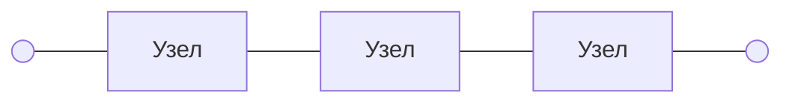
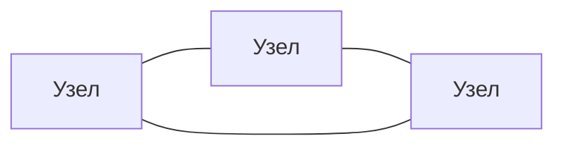
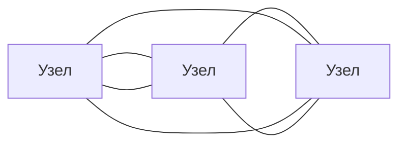
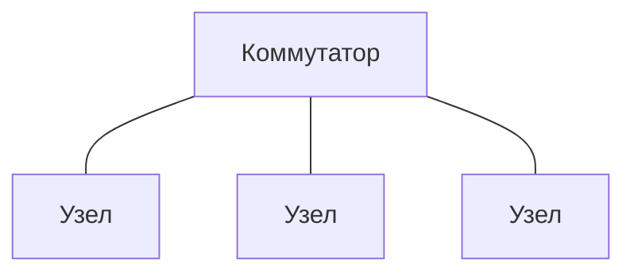
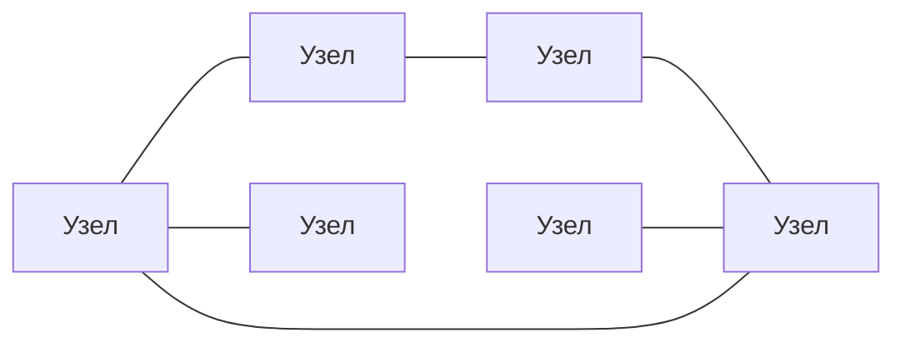

**Вычислительная** (**компьютерная**) **сеть** — это система, обеспечивающая обмен данными между **узлами сети**.

## Классификация

### Территориальная

|Класс|Охват|
|-----|-----|
|**PAN**, Personal Area Network|Устройства одного пользователя|
|**LAN**, Local Area Network|Квартиры, офисы и здания
|**MAN**, Metropolitan Area Network|Города и населённые пункты
|**WAN**, Wide Area Network|Страны, регионы и континенты
|**GAN**, Global Area Network|Весь мир

### Архитектурная

#### Клиент-сервер

Выделенные узлы-**серверы** обслуживают всех остальных — **клиентов**.
|Преимущества|Недостатки|
|--|--|
|Высокая масштабируемость|Дороговизна|
|Администрируемость|Сложность|
||Централизованность|

#### Одноранговая (P2P)

Все узлы **равноправны**: каждый из них может быть как клиентом, так и сервером.
|Преимущества|Недостатки|
|------------|----------|
|Анонимность|Бесконтрольность|
|Децентрализованность|Низкая масштабируемость|
|Дешевизна|

### Топологическая

#### Шина

Узлы подключены к единой линии, ограниченной **терминаторами**, предотвращающими отражение сигнала.

#### Кольцо

Узлы подключены к закольцованной линии.

#### Двойное кольцо

Узлы подключены к двум закольцованным линиям: основной и резервной.

#### Звезда

Устройства подключены к центральному узлу: маршрутизатору, коммутатору или хабу.

#### Ячеистая

Каждый узел соединён с одним или несколькими соседями.

