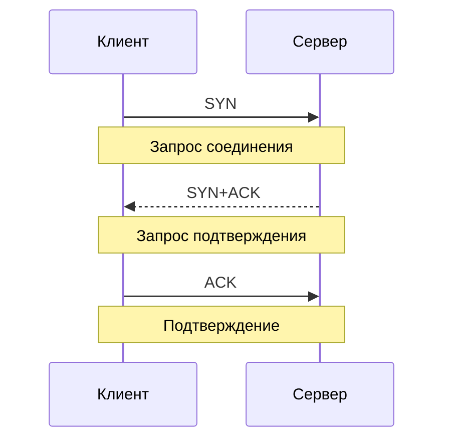
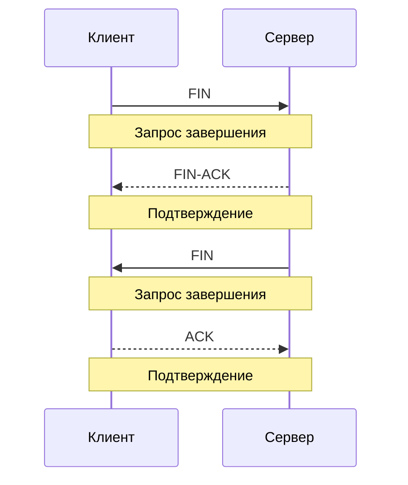
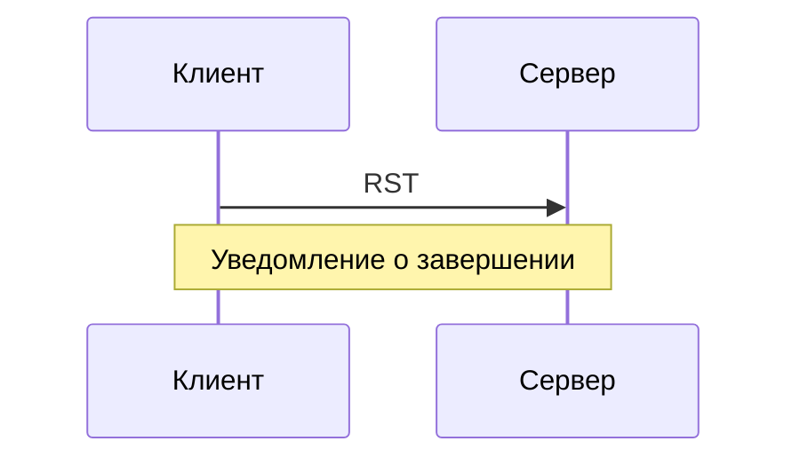

**Transmission Control Protocol** (**TCP**) — это L4-протокол, обеспечивающий надёжное полнодуплексное соединение между процессами. Использует **TCP-сегменты**.

## Установка соединения

Виртуальное соединение устанавливается с помощью **трёхстороннего рукопожатия** (**three-way handshake**):

## Передача данных

## Завершение соединения

### Нормальное

При обычных условиях соединение завершается с помощью **четырёхстороннего рукопожатия** (**four-way handshake**):

> [!NOTE]
> Четырёхстороннее рукопожатие гарантирует, что **обе стороны** закончили передачу данных, а не только одна из них.

### Срочное

В экстренных ситуациях соединение может быть разорвано моментально: 

> [!CAUTION]
> Если уведомление не дойдёт до адресата, соединение станет **полуоткрытым**.

## Сегмент

### Псевдозаголовок

Формируется только в памяти процесса, позволяя вычислять полную контрольную сумму.

|Поле|Размер (бит)|Описание|
|----|------------|--------|
|**Source IP Address**|32|—|
|**Destination IP Address**|32|—|
|**Zero**|8|Заполнитель|
|**Protocol**|8|Используемый L4-протокол|
|**TCP Length**|16|Длина всего сегмента в байтах|

### Строение

|Поле|Размер (бит)|Описание|
|----|------------|--------|
|**Source Port**|16|—|
|**Target Port**|16|—|
|**Sequence Number**, SN|32|Порядковый номер полученного сегмента|
|**Acknowledgment Number**, ACK SN|32|Порядковый номер запрашиваемого сегмента|
|**Data Offset**|4|Длина заголовка в 32-битных словах|
|**Reserved**|4|Зарезервировано для будущих флагов, таких как [NS](https://datatracker.ietf.org/doc/html/rfc3540)|
|**Flags**|8|>>>|
|**Window Size**|16|???|
|**Checksum**|16|—|
|**Urgent Pointer**|16|???|

#### Flags

|Поле|Размер (бит)|Описание|
|----|------------|--------|
|**CWR**, Congestion Window Reduced|1|—|
|**ECE**, ECN-Echo|1|—|
|**URG**, Urgent|1|—|
|**ACK**, Acknowledgment|1|—|
|**PSH**, Push|1|—|
|**RST**, Reset|1|—|
|**SYN**, Synchronize|1|—|
|**FIN**, Finish|1|—|